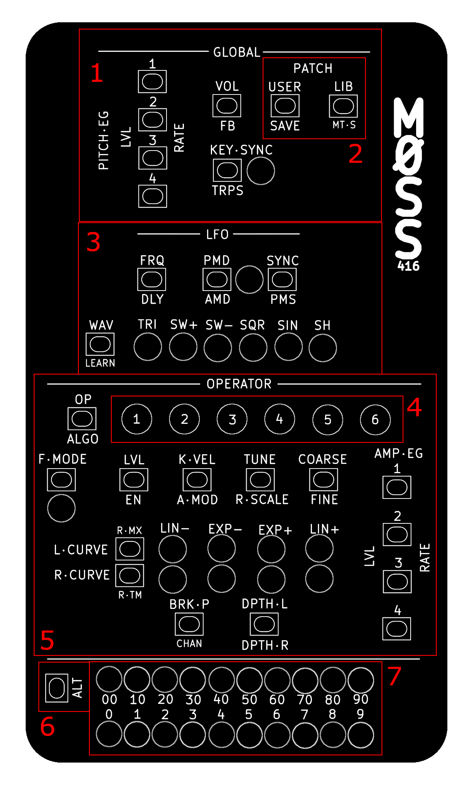
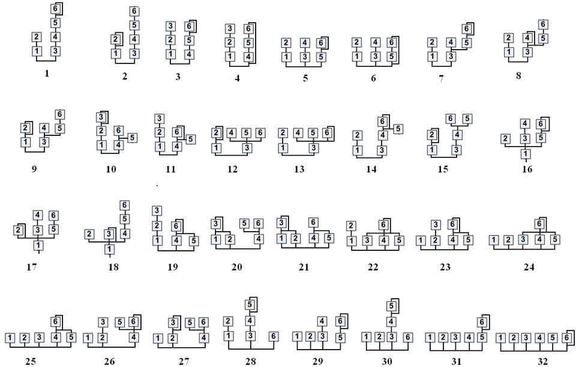
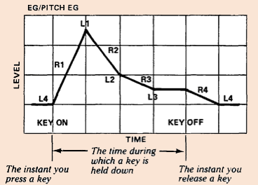

# Introduction {.page-break-before}

The M0SS-416 is the fourth in the line of M0SS synthesizers. It is a DX7 emulator, which means that its synthesis engine emulates that of the DX7s to a very high degree. It is based on an open source project called Dexed, but also builds on the work of another open source project called MiniDexed, which makes it possible to run Dexed on a microcontroller.

Unlike Dexed and MiniDexed, the M0SS-416 endeavors to provide a user experience that completely avoids screens. The DX7 synthesis engine consists of 41 parameters, and these parameters determine how each of the 6 operators will sound, how they will interact, and how the LFO and global parameters interact with them. The M0SS-416 has a button, or a button combination to access each of these parameters.

The DX7 engine uses discrete numbers, for example an integer like 45, as opposed to a decimal number like 45.523. Most of these parameters can be set to a value from 0..99, though others have a smaller range of values. To display discrete numeric values, the M0SS-416 has a pair of rows of LEDs at the bottom of the device. The top row shows the 10’s position (0, 10, 20 ... 90), and the bottom row shows the 1’s position (0, 1, 2 ... 9). Together they express a number from 0 to 99.

We have done our best to provide a balance between the classic DX7 workflow, the Dexed workflow, and our own proprietary work flow, when it comes to loading and saving patches, and working with sysex data. This keeps M0SS-416 compatible with many of the available tools for the DX7 and for the Dexed ecosystem.

We hope that M0SS-416 provides many years of inspiration to both DX7 power users looking to go screen-less and portable, and for new DX7 acolytes, scrolling built-in presets, downloading patch banks that they find online, and beginning to tweak and modify existing patches, and maybe one day building new patches from scratch.

## Connections

The M0SS-416 is powered by a standard DC barrel jack, often used for guitar pedals. It takes 9V center negative power, provided at the port at the top. It draws ~200 mA, plus whatever power is drawn by a connected USB MIDI controller.

Audio output is a stereo unbalanced line level 1/4” jack.

There are two options for MIDI input: TRS type A located on the left side of the device, or USB MIDI host port located on the back. The M0SS-416 will power an external controller through its USB MIDI host port.

The M0SS-416 also includes MIDI TRS type A thru, located on the right side of the device. Note that this is soft-thru.

An SD Card is accessible on the right side of the device. This SD Card contains firmware, patches, microtuning scales, and other configuration files for the M0SS-416. To remove the SD Card, ensure power to the M0SS-416 is OFF, then using a small plastic tool, or a fingernail, depress the SD Card inward untill you hear a 'click', then release the SD Card and it will eject. To re-install the SD Card, re-insert it into the slot, and depress it until you hear a click, release the SD Card and it will now be locked in place.

## Extra Resources

- M0SS Discord Server: [https://discord.gg/SX8BX6Hhq4](https://discord.gg/SX8BX6Hhq4)
- Ultrapalace Youtube Channel: [https://www.youtube.com/@ultrapalace](https://www.youtube.com/@ultrapalace)
- Ultrapalace Website: [https://www.ultrapalace.com](https://www.ultrapalace.com)

# Getting Started {.page-break-before}

Using a standard guitar pedal power adapter, plug in your M0SS-416. It will boot immediately (there is no power ON/OFF switch for the device). Connect a MIDI controller either via TRS or USB jacks, and connect the audio out to a destination.

By default, the device is set to respond to all MIDI channels (Omni), so simply press a key on your controller and hear the response.

## How to Use the Interface

The M0SS family of products has a unique way of interacting with its parameters, which is what allows us to make the devices so small. Each button on the interface corresponds to a parameter, labelled above or beside the button. To select the parameter, simply press the button. There are also shift parameters, secondary functions for buttons indicated by labels in smaller text. To access these, hold the ALT button before pressing the button you want to select.

Parameters come in three types: Selectors, Numeric Entries, and Switches. Modifying these parameters works differently.

## Editing Selectors

Selectors are indicated by a row of LEDs below or beside the button, each with a label corresponding to the option. Repeated presses of this button will cycle through the available options for this parameter, indicated by the LEDs changing.

## Editing Numeric Entries

Numeric Entry parameters hold a discrete numeric value. Once a Numeric Entry parameter is selected, the bottom rows of LEDs on the unit will light, indicating the corresponding value. While that Numeric Entry is selected, simply rotate the encoder to change its value.

## Editing Switches

Editing switches works in mostly the same way as Selectors, but these parameters only have 2 values: On and Off. Many Switches will have an LED indicating its state, a lit LED means On, a non-lit LED means Off. Repeated presses of the button will toggle its value. If the Switch lacks a dedicated LED, then its state will be shown on the bottom LED rows, and will operate like a Numeric Entry, where 0 means Off, 1 means ON and turning the encoder will toggle the value.

## MIDI Controls

M0SS-416 accepts many MIDI controls, including velocity, pitch bend, program change, after touch and the following CCs:

- CC0 Bank Select MSB: bank MSB.
- CC1 Modulation: pitch modulation.
- CC5 Portamento Time.
- CC7 Volume.
- CC10 Pan.
- CC11 Expression.
- CC32 Bank Select LSB: bank LSB.
- CC64 Sustain.
- CC65 Portamento: portamento mode on/off.
- CC66 Sostenuto: sostenuto on/off.
- CC69 Hold2: hold mode on/off.
- CC71 Resonance: filter resonance.
- CC74 Cutoff: filter cutoff.
- CC91 Reverb Send: reverb send.
- CC94 Detune: master tune mapping.
- CC120 All Sound Off: panic.
- CC123 All Notes Off: notes off (ignored in Omni mode, and also can be globally ignored by config).
- CC124 Omni Off: restores previous channel from Omni.
- CC125 Omni On: sets Omni.
- CC126 Mono On: mono mode.
- CC127 Poly On: poly mode.

## MIDI Learn

To map an external controller’s CC knobs to a parameter in your M0SS unit, follow the steps below.

1. Activate MIDI learn mode by pressing the LEARN button (ALT + WAV). Once in MIDI learn mode, all LEDs will light orange.
2. Select any parameter by pressing a button (shift parameters are also selectable). The LEDs will light yellow.
3. On your controller, send a MIDI CC (by turning the knob/slider you want to assign). The LEDs will light green.
4. Press ALT to exit, or select another parameter to map, continuing from step 2.

To map MIDI AFTERTOUCH, hold a note on the keyboard, perform steps 1 and 2, then modulate the aftertouch (change the pressure with which you hold down the note).

To map velocity, perform steps 1 and 2 then press any key on the keyboard.

## MIDI SYSEX

M0SS-416 will receive parameter modifications via DX7 compatible MIDI SYSEX messages. This allows you to connect the M0SS-416 to your computer using a MIDi TRS cable, and use an application like DEXED to controll all the parameters in the engine.

## Changing the Patch

The M0SS-416 comes pre-loaded with a library of 6 banks of presets (each with 32 voices) from the classic DX7 sound cartridges.

Press the LIB button to enter Bank Load Mode. The Numeric LEDs will show the Patch number (0-31) in Blue LEDs, and the Operator LEDs will display the Bank Number (1-6) in blue LEDs. Turn the encoder to scroll through the voices and banks. Press any other key to leave Bank Load Mode.

# General Description {.page-break-before}

The DX7 synthesis engine is based on frequency modulation (FM) synthesis, where six sine-wave operators interact through one of 32 fixed algorithms. Each operator has a frequency setting that can run in ratio mode (tracking keyboard pitch) or fixed mode (absolute frequency in Hz), along with coarse and fine tuning and a small detune offset. These parameters define the harmonic relationship between operators — integer ratios produce harmonic, “musical” tones, while non-integer ratios introduce inharmonic or metallic textures. Each operator also has an output level, which in FM directly controls modulation depth (for modulators) or amplitude (for carriers), making it one of the most sensitive and important parameters in shaping the sound.

Beyond basic frequency relationships, the DX7 provides several parameters that control how a sound responds across the keyboard and to performance. Keyboard level scaling allows an operator’s level to change depending on key position, using breakpoint, left/right depth, and curve types — this is crucial for making patches feel natural across the range. Velocity sensitivity (key velocity) can modulate operator output, enabling dynamic control over brightness or loudness. There is also rate scaling, which speeds up envelopes in higher registers to mimic acoustic behavior. Operators can optionally be affected by amplitude modulation (AM) from the LFO, and each patch includes a global feedback parameter (applied to one operator in the algorithm) that routes an operator back into itself to generate noise-like or more complex waveforms.

Time variation is handled by the DX7’s detailed envelope generators, with four rates and four levels per operator, allowing precise shaping of both amplitude and modulation over time. Unlike subtractive synths, this means the harmonic content itself evolves dynamically. The global section adds a pitch envelope generator for pitch sweeps and a flexible LFO with parameters like frequency, delay, waveform, pitch modulation depth (PMD), and amplitude modulation depth (AMD). There is also key sync for resetting LFO phase per note. Together, these parameters allow the DX7 to produce highly expressive, time-evolving sounds—where timbre is not filtered after generation, but instead constructed and animated directly through operator interactions.

## Front Panel Overview {.page-break-before}

{width=600px}

1. Global parameters for the engine
2. Lib/User/Save/MT-S button for Loading and Saving presets and Microtuning scales.
3. LFO controls. WAV toggles through the waveforms.
4. Operator selection. Press OP to toggle through the 6 operators.
5. Operator parameters. Control the currently selected operator.
6. The ALT button. Use to access parameters written in smaller font next to or below buttons.
7. The numeric LED display, showing values from 0 .. 99. The top row shows the 10s position (0, 10, 20, ... 90) and the bottom row shows the 1’s position (0, 1, 2, ... 9). Together they represent an integer from 0 to 99.

## Operators

The DX7 synthesis engine consists of 6 operators in one of 32 configurations. These configurations are called algorithms. The following diagram describes these 32 algorithms.

{width=600px}

To select the Algorithm for your patch, press ALGO (ALT + OP). The current algorithm number will display on the Numeric LEDs. Turn the encoder to change the Algorithm number.

The EN parameter enables/disables the current Operator. A disabled operator will have a Blue LED in the Operator LED row, and when it is selected, all the Operator controls will show Blue LEDs to indicate that you currently have a disabled operator selected.

## Envelope Generators

The DX7 rate/level style envelope generator is more advanced then a typical ADSR. On M0SS-416, you will see level (LVL) and RATE controls. RATE is the ALT function for these buttons. This diagram helps to describe how they function.

{width=600px}

## Building a Patch

The DX7 engine is very complex, and well documented elsewhere, so I will not attempt to explain it here. Suffice to say there is a 1:1 correlation between the DX7 and the M0SS-416.

Since the M0SS-416 can only communicate positive integers from 0..99, there are a few quirks when translating DX7 values to M0SS-416 values, which may come up when working from DX7 patch sheets, or other documentation for the DX7. Here is a list of the edge cases, and how they are handled for M0SS-416

| DX7 parameter | DX7 value range | M0SS-416 control | M0SS-416 value range |
|---|---:|---|---:|
| Algorithm | 1-32 | `ALGO` | 0-31 |
| Transpose | C1-C5 (+/- 24) | `TRPS` | 0-48 |
| Oscillator frequency mode | Ratio or Fixed | `F.MODE` | 0 = Ratio, 1 = Fixed |
| Ratio frequency | 0.50, 1.00-31.99 | `COARSE` and `FINE` with `F.MODE=Ratio` | `COARSE` 0-31, `FINE` 0-99 |
| Fixed frequency | 1 Hz, 10 Hz, 100 Hz, or 1000 Hz base range, adjusted by `FINE` | `COARSE` and `FINE` with `F.MODE=Fixed` | `COARSE` 0-3, `FINE` 0-99 |
| Osc Detune | -7..+7 | `TUNE` | 0-14 |

- In Ratio mode, `COARSE` sets the main frequency ratio. `COARSE=0` means `0.50`; `COARSE=1` means `1.00`; `COARSE=31` means `31.00`. `FINE` scales that ratio upward in hundredths, so `COARSE=1` and `FINE=50` gives `1.50`, while `COARSE=2` and `FINE=50` gives `3.00`.
- In Fixed mode, `COARSE` selects the base frequency range: `0` = 1 Hz, `1` = 10 Hz, `2` = 100 Hz, and `3` = 1000 Hz. `FINE` moves upward within that selected range. The firmware accepts higher `COARSE` values in this mode, but they repeat the same four ranges, so values above `3` are not useful for manual editing.

- `BRK.P` note conversion uses a direct index table:
  - 0 = `A-1`
  - 27 = `C2`
  - 28 = `C#2`
  - 39 = `C3`
  - 99 = `C8`

## Master FX

The M0SS-416 has 3 Master FX: Reverb, a low-pass Filter, and a compressor.

2 parameters of the reverb are accessible from the physical interface: Reverb Time (R-TM) and Reverb Mix (R-MX).

Controls for the low-pass filter are accessible with MIDI CCs (see [MIDI Controls](#midi-controls)).

The compressor can be turned on and off by editing a file on the SD Card called Performance.ini

## Polyphony

The M0SS-416 has 16 voices of polyphony, meaning it can generate 16 notes at once, each on its own voice. There is a voice stealing algorithm which determines what happens when more than 16 notes are playing at once. When the 17th note is started, it will look for the oldest note, giving preference to notes which are not currently held (but are still in sustain), and it will prune that voice, meaning it will stop playing the note it is currently playing, and begin to play the new pitch.

Using CCs 126 and 127 (see [MIDI Controls](#midi-controls)), you can toggle MONO mode, which means only 1 voice is active.

# Managing Patches {.page-break-before}

The M0SS-416 has 2 kinds of presets, each with its own file type. The first type is the DX7 .syx Bank file, which contains 32 voices, and is essentially the data contained on an original DX7 Sound Cartridge. M0SS-416 can store 6 of these Banks on the SD card.

The second kind are User Voices, each of which represents one preset. M0SS-416 can store up to 100 of these (User Voice 0 - 99). User Voices are saved to the SD card as 156 hex bytes in ascii format (about 468 bytes each on disk).

M0SS-416 can read Bank files (but cannot save them), and can both save and read User Voices.

You may however load a voice from a Bank file, optionally modify it, and then save it to a User Voice.

Changing the Bank files on your M0SS-416 requires removing the SD card, connecting the SD Card to a computer, and copying files onto it like an external drive, using a special naming convention.

## Bank Files

Bank files are stored at /sysex/voice on the M0SS-416 SD Card.

DX7 Bank files are .syx files that have been dumped from a DX7, or authored using special software. They are a collection of exactly 32 voices, stored as a Bank. They are always exactly 4104 bytes. You can find these files for free or for sale online, exchange them with friends, and collect them using a DX7 patch librarian like DX7II Librarian. Some software will allow you to take voices out of a Bank file, assemble your own banks, and export them.

M0SS-416 can access up to 6 Bank files at a time, for a total of 192 voices. M0SS-416 comes pre-loaded with 6 Banks, but you can also change those files. To do so, follow the steps below.

1. Make sure the M0SS-416 is off (remove DC power).
2. Remove the SD card.
3. Connect the SD card to a computer, using a USB SD card adapter if needed.
4. Opening the SD card on your computer, navigate to /sysex/voice.
5. Delete or rename one or more of the files there, and replace them with your own .syx files containing valid DX7 banks.
6. Eject the SD card, place it back into the M0SS-416, and power it back on.

The names of these files determine the order that they will be loaded, and in turn, the order that they will be available in the Bank Load process. The first number that is seen in the filename gives the order so “0001_my_horns.syx” will load before “8_tims_drums.syx”, and “my_flute_5.syx” is not valid, because it starts with a letter. Only the first 6 valid .syx bank files will be loaded into the M0SS-416. In this example “0001_my_horns.syx” will be in Bank 1, “8_tims_drums.syx” will be in Bank 2, and Banks 3 through 6 will be empty (“my_flute_5.syx” will not load at all).

## User Voices

User Voices are stored at /user in the M0SS-416 SD card.

These are a proprietary format called .uvx (which stands for User Voice Hex). It is 156 bytes of hex data stored as ascii text ex. “63 40 62 3D 63...”. M0SS-416 will hold up to 100 User Voices, and initially all 100 User Voices are empty. It is possible to manually copy/paste these ascii strings, and to thereby share them with others, if you like.

The naming convention for these files is simply 0.uvx to 99.uvx, where 0.uvx is loaded into slot 0, and 99.ovx is loaded into slot 99 at boot.

## Loading Patches

M0SS-416 has 2 Loading modes, the first is Bank Load Mode, and the second is User Voice Load Mode. Pressing the LIB button activates Bank Load Mode, and pressing the USER button activates User Voice Load Mode (unless there are no User Voices in memory, in which case pressing this button does nothing).

In Bank Load Mode the Numeric LEDs will show the position inside the current Bank (0-31) and the Operator LEDs will show the current Bank number (1-6).

In User Voice Load Mode the Numeric LEDs will show the current User Voice number (0-99).

In either Load Mode, turn the encoder to scroll through the presets, this will always immediately load the next preset.

Pressing any other button will exit Load Mode.

## Saving User Voices

To activate Save Mode press SAVE (ALT + USER). The User Voice slots that are occupied will glow green, the current slot will be yellow. A cursor is shown by a flashing red LED. Move the cursor using the encoder. Press the encoder button to save the preset to the slot indicated by the save cursor. This can overwrite a slot.

The save procedure can be executed at any time. It is possible to copy a voice from a Bank, to modify an existing User Voice and save the changes to a new slot, or to use MIDI SYSEX to upload a single voice and save it to a User Voice slot.

## Load Voice Data over MIDI SYSEX

The M0SS-416 can receive voice parameters over MIDI SYSEX. Desktop and Web Tools like Synthmata and others will allow you to send single-voice patch data in this way. To execute this, simply connect your computer to the M0SS-416 using MIDI TRS, and send the MIDI SYSEX. The M0SS-416 will receive these commands, and you will now have that sound loaded. You must then save the voice to a User Preset if you want it to persist. After a successful SYSEX transfer, all LEDs will flash green, after a failure they will flash red.

NOTE: Never attempt to connect your M0SS-416 to a computer using USB, the USB-A Host port is only safe to connect to USB “devices” (such as a keyboard) and not to USB “Host” like a computer. Doing so can potentially damage both devices.

# Other Capabilities {.page-break-before}

M0SS-416 has some additional capabilities controlled by special files on the SD Card, allowing you to control CC mappings, parameter defaults, Master FX, Pitch Bend range, microtuning scales, etc.,

## Microtuning

The /scales directory can be populated with up to 100 .scl files, these are Scala scale files which change the intonation of the notes that the M0SS-416 will produce. This capability is called microtuning, and it allows you to use historically accurate temperaments, temperments from various cultures across the world, experimental tunings, or to generate your own unique tunings and temperments.

The default tuning is 12-TET, and this tuning always occupies slot 0. To change the tuning, select the MT-S parameter (ALT + LIB), and turn the encoder.

## m0ss-config.txt

This file controls the state of the M0SS-416 at boot. It allows several settings and parameters to persist after a reset of the device, including:

- The Microtuning Scale.
- The MIDI channel.
- The Bank/Voice or User Voice.
- The reverb mix and time.

## performance.ini

This file contains more settings which are currently experimental, including pitchbend range, portamento, glissando, note range limits, etc.. Experiment with these at your own risk.

## m0ss-cc-map.txt

This file stores what parameter in the synth engine is controlled by each MIDI CC. There are some defaults, and they will be overwritten by MIDI Learn.

## kernel8.img

This is the M0SS-416 firmware file. As updated and alternative firmwares become available, this is the file that will be updated on the SD Card. It must always be called exactly kernel8.img, so you will need to keep these files organized in some way, since the files names will not differentiate between them.
