# M0SS-416 BUILD GUIDE
( last updated July 26, 2026 )

## Here are the contents of the kit

| Quantity | Item |
|---------|------------------------------------------------|
| 3       | PCBs (front panel, LED board, main board) |
| 1       | 30p Flat Flex cable |
| 1       | 12p Flat Flex cable |
| 1       | Encoder + nut |
| 1       | Encoder Knob |
| 1       | 7mm Standoff |
| 1       | M2 x 4mm screw, T8, Black |
| 1       | M2 x 4mm screw, T8, Silver |
| 1       | SD Card |
| 5       | 6-32 x 3/8" screw, Hex |
| 4       | Silicon Feet (not pictured) |
| 1       | Aluminum enclosure (not pictured) |

 

## You will need
- Pliers
- Soldering Iron
- Solder
- A T8 torx bit and driver
- A 2mm Allen Wrench or 2mm hex bit and driver

 

## STEP 1: Add solder to the 1/8" jacks
- These parts were sometimes not soldered well at the manufacturer. Add solder to the 6 tabs (3 tabs on each 1/8" jack) to reinforce them. During this process be VERY cautious to not melt the plastic parts of the jack, nor any of the surrounding parts, like LEDs. You can optionally add one drop of super glue to add strength, place it at the base of the part near the outside edge of the board, but be very careful not to add more then 1 drop, or you risk glueing the part shut!

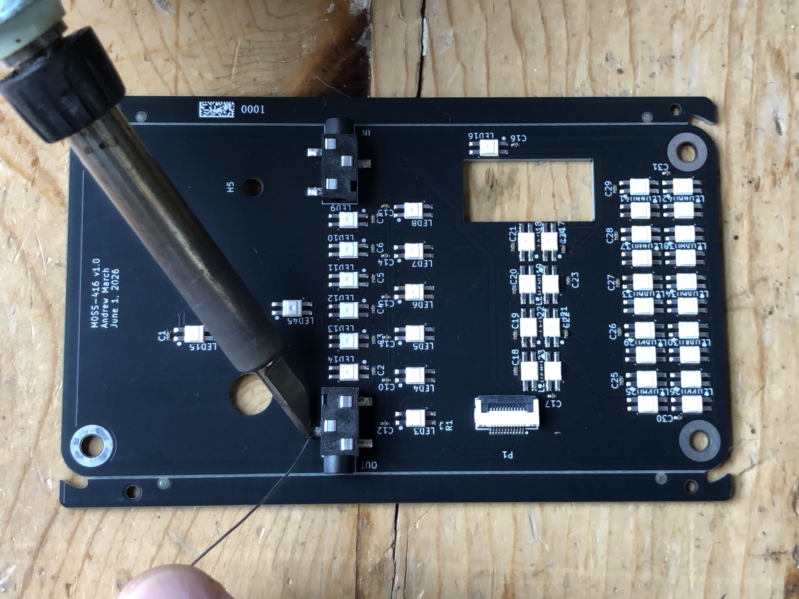

 

## STEP 2: Remove the edge rails from all PCBs

- Using pliers, carefully snap off the edge rails. There are rails on the left and right sides of each PCB, 6 edges in total to be removed.

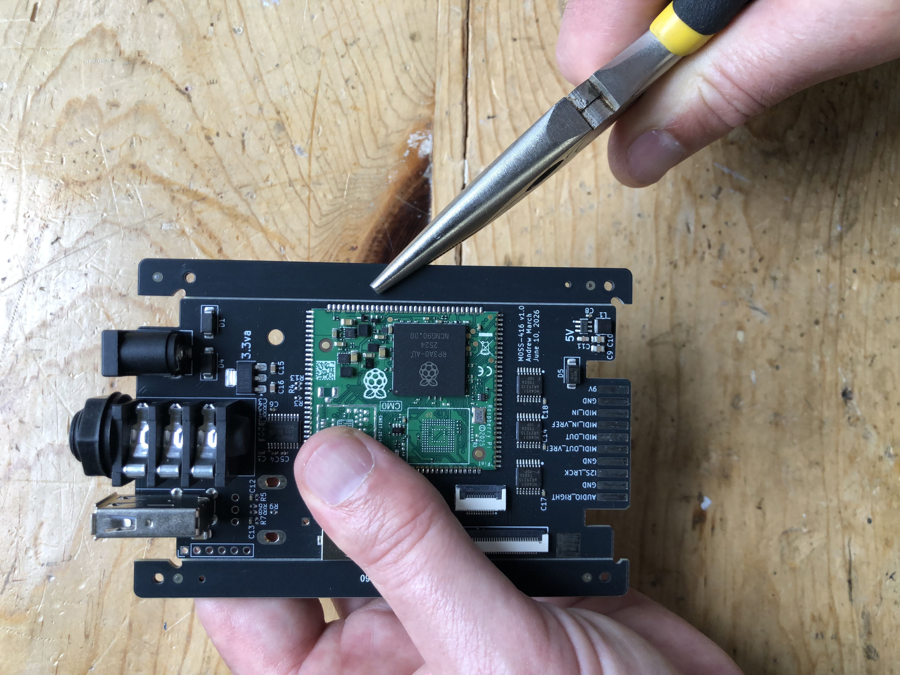

 

## STEP 3: Place and solder the encoder

- Confirm you are placing the encoder on the correct side, by checking for the white outlined shape of the part, drawn on the PCB. The encoder goes on the back side.  
- Slightly bend the lugs of the encoder inward, using pliers, or by gently pressing them into the table.  
- Carefully place the encoder. If the lugs will not go in, bend them inward a little more.  
- Solder one pin of the encoder, and check that it is seated correctly.  
- Proceed to solder all the pins, and then the lugs.

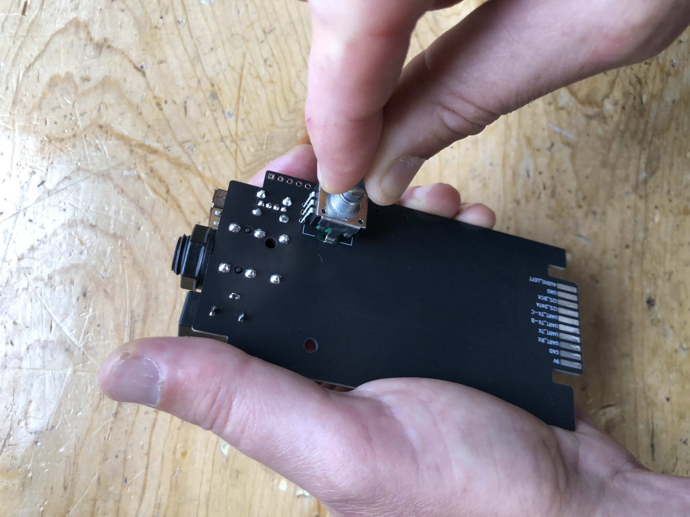

 

## STEP 4: Install the standoff

- The standoff goes on the back side of the LED PCB.  
- Use the black M2 x 4mm screw, and be careful to not over tighten it. ⅛ of a turn past hand-tight is great.

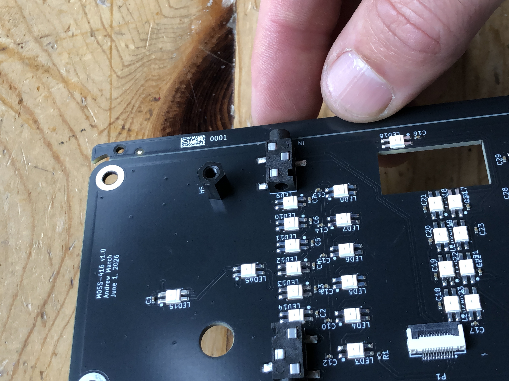

 

## STEP 5: Shape the large Flat Flex Cable (FFC)

- On one end of the large FFC, using your thumbs, gently create a concave bend in the blue-section of the cable.
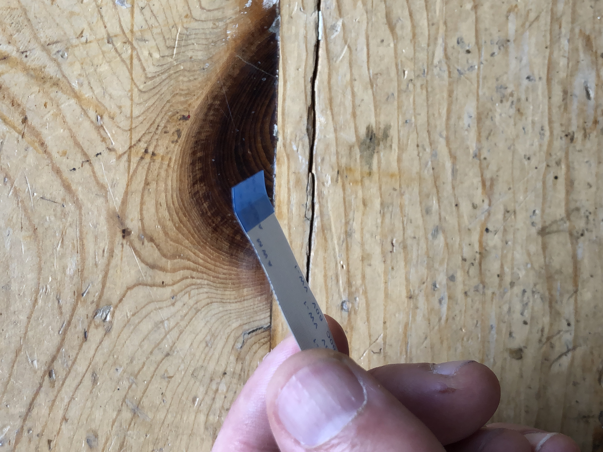

 

## STEP 6: Install the Flat Flex Cables (FFCs)

- Install the non-shaped end of the large FFC onto the back side of the front panel board. The large FFC connector is a flip-lock type. Using a small tool or a fingernail, lift the black lock up and back to fully open the connector.   
- Insert the large FFC with the blue stripe up. Ensure it is fully seated and square, then close the lock.

 

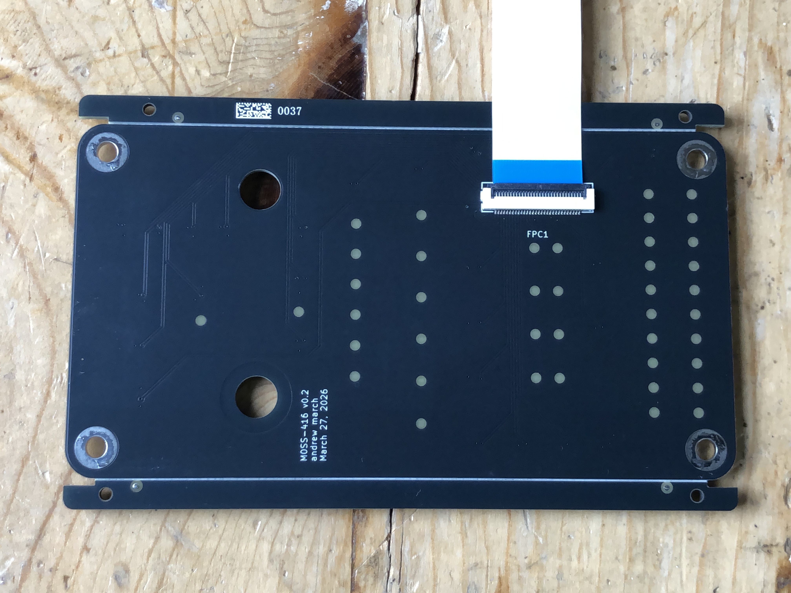

- Install the small FFC onto the LED board. The small FFC connector is also a flip-lock type.
- Insert the small FFC with the blue stripe up, sliding it under the lock, and gently wiggle it into place. This may take some patience, and it is ok to try the other end, if you are struggling.  
- Close the lock.

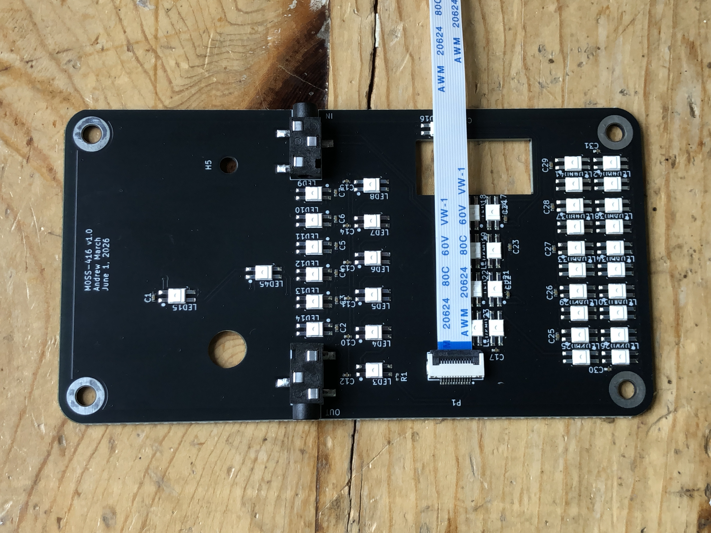

 

## STEP 7: Assemble the stack-up.

- Thread the large FFC through the large cutout in the LED board, and bring the 2 boards together back-to-back.

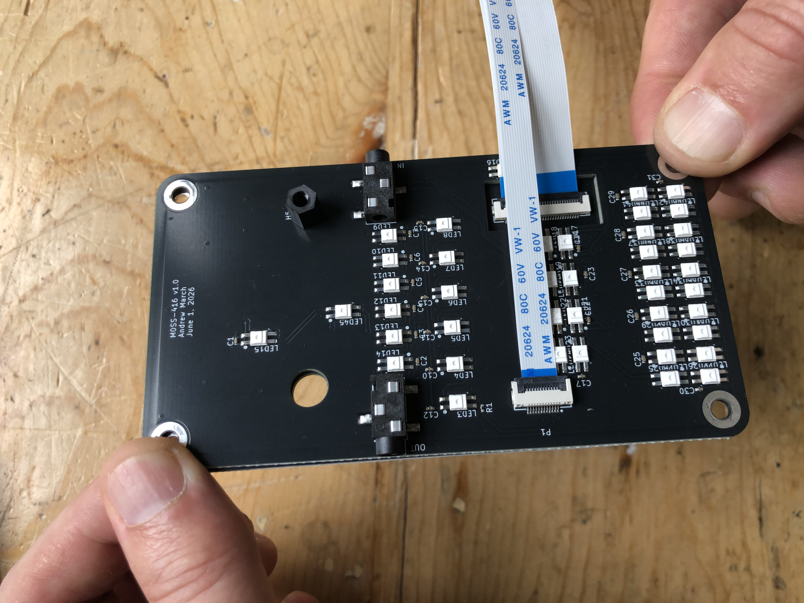

- Holding the main board with the encoder facing down toward the other boards, pass the encoder through the large round hole in the 2 other boards.
- Install the silver M2 x 4mm screw through the small hole on the Main PCB, to the standoff on the LED board.
- On the front panel board, install the encoder nut. When tightening the encoder nut, exercise caution to not scratch the panel, and to not damage any adjacent buttons. Using a plastic socket is ideal.
- Use the same procedure in step 5 to install both FFCs to their respective connectors on the main board. The shaped end of the large FFC will help navigate past the small FFC connector which is very close to the connector for the large FFC.

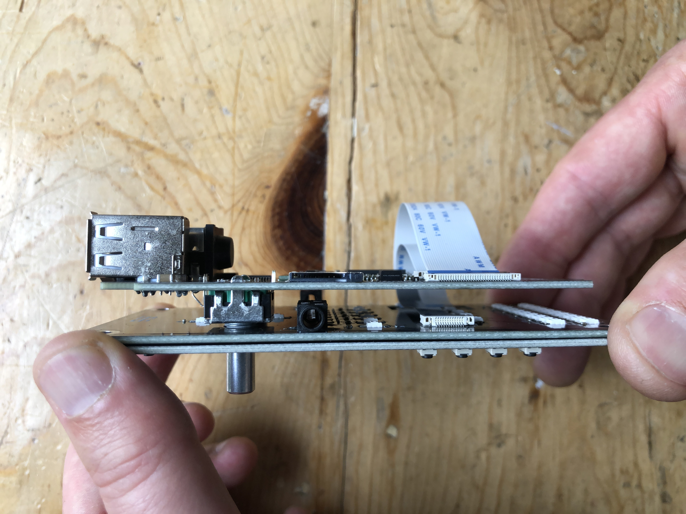
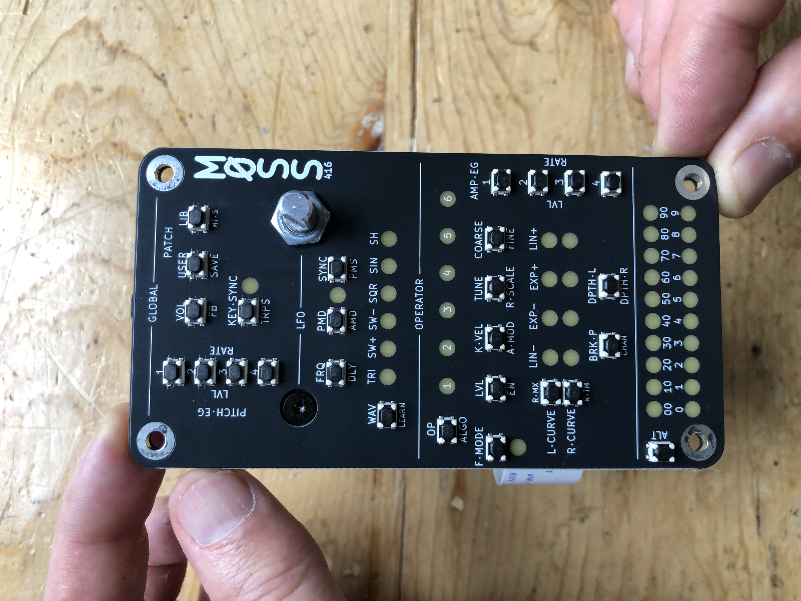
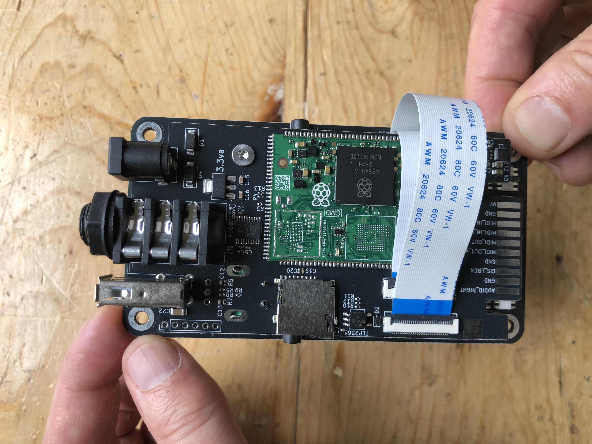

 

## STEP 8: Install the enclosure

- Place the PCB assembly into the enclosure, inserting the jacks first.  
- Install the 4 large black 6-32 x 3/8" screws.  
- Install the plastic washer and nut onto the audio jack.  
- Install the knob onto the encoder, looking for the irregularity inside the knob, which mates with the flat side of the encoder shaft.  
- Optionally, affix the 4 adhesive feet, on the bottom of the enclosure, at each corner.

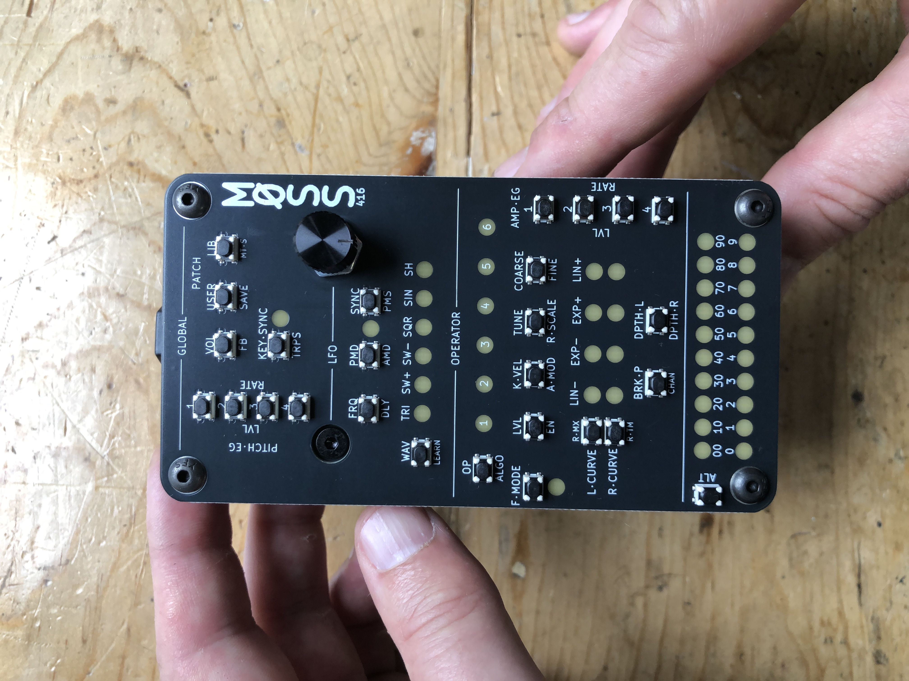  
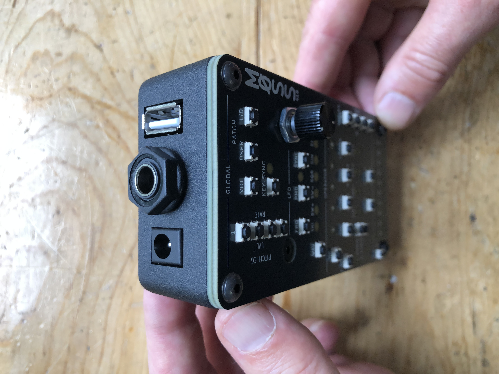

 

Here some details on the I/O:
- Power input is 9v DC, center negative. M0SS-416 draws up to 800mA with a USB Device connected.
- MIDI jack 1 (on the left side) - MIDI input, Type-A.
- MIDI jack 2 (on the rightside) - MIDI thru (soft-thru), Type-A.
- Audio output - 1/4" Unbalanced line level stereo.
- USB - USB-A Host, it is safe to draw up to 500mA (USB Spec). It should work with any class compliant MIDI Device, but will not work with another USB Host (like a computer). 

 

## STEP 9: Flash the SD Card files, and instal the card

- Download `sdcard.zip` from this repository.
- Unzip the contents, this will produce a directory called `sdcard`
- Copy all the contents of `sdcard` (not the directory itself) to your SD Card
- Eject the SD Card safely from your computer
- Holding the SD Card upside down, insert it into the rectangular slot on the right-hand side of the M0SS-416.
- Using a small plastic tool, or a fingernail, gently depress the SD Card deeper into the slot, until you perceive a 'click' sound. This is the card locking into place.

 

## STEP 10: First boot

- Apply power to the M0SS-416.
- After about 4 seconds, lights on the front panel should twinkle for a few more seconds as it boots.
- Pressing the encoder should produce a square wave.
- Remove power.

 

## STEP 11: Construct the manual

- I found this cute diagram online, use it to fold your manual into a tiny book.

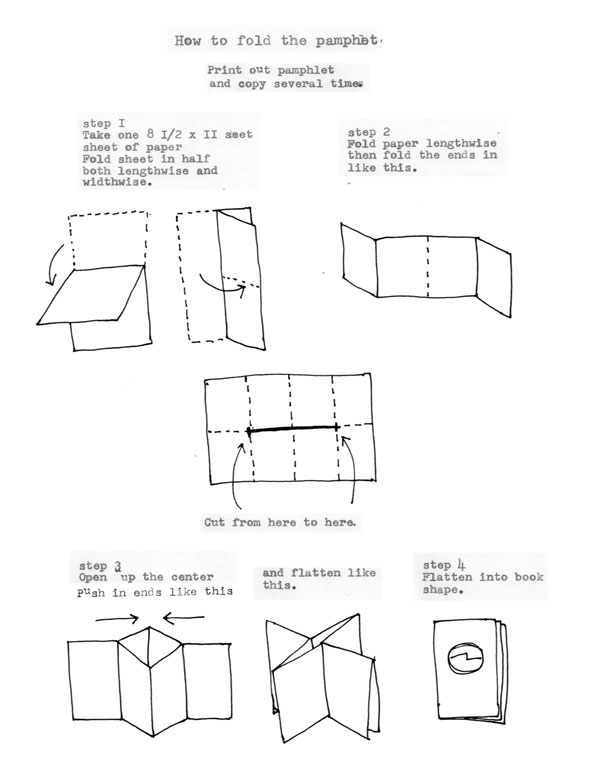

- If you have done it right, it should look like this

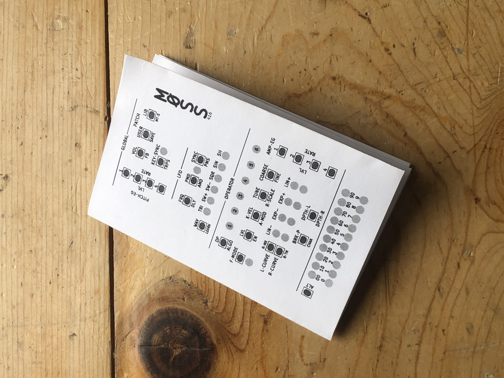
